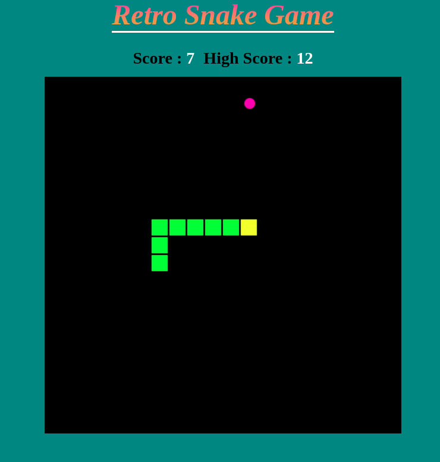
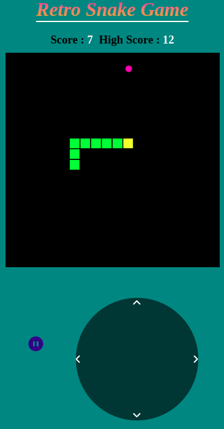

# Retro Snake Game

Our favorite game of late 90's. It was very popular game of that time.

## What's in the game?

- Snake will eat the food which will spawn on random location.
- Snake will grow it's size after eating the food.
- If snake will hit it's own body then the game will over!
- You can track your score and high score.

### How to play in Desktop or laptops

- Keybindings are arrow keys to move
- use spacebar to pause/resume the game

### How to play in Mobile devices

- a joystick will appear in mobile screen
- game pause/resume button in given

## Screenshots

## Authors

- [@ujjawalbiswas](https://www.linkedin.com/in/ujjawal-biswas-b40611142/)

## License

[GPL](https://choosealicense.com/licenses/mit/)

